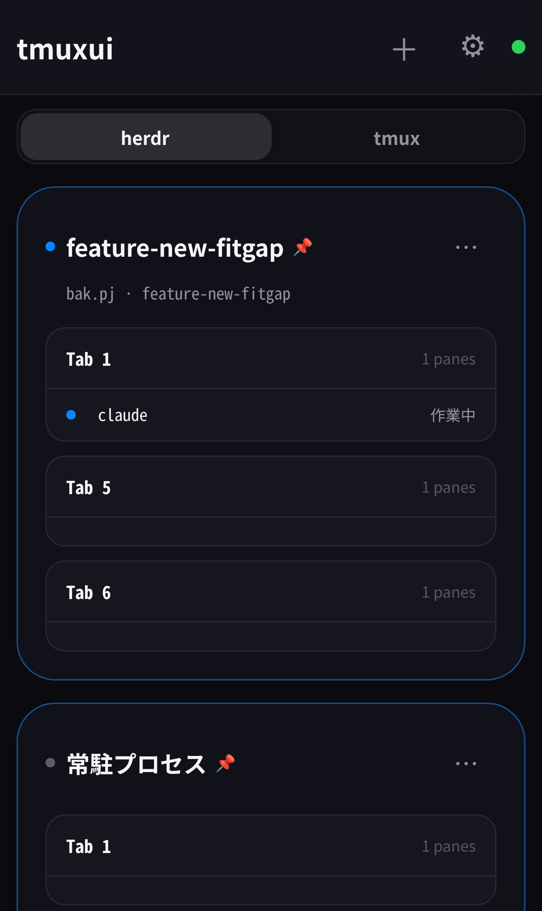
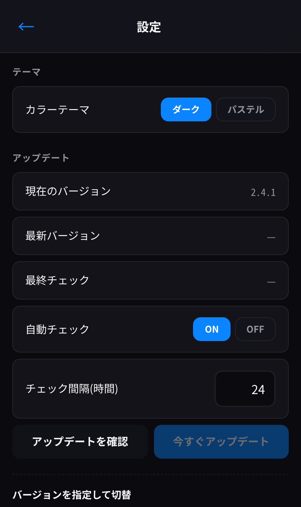
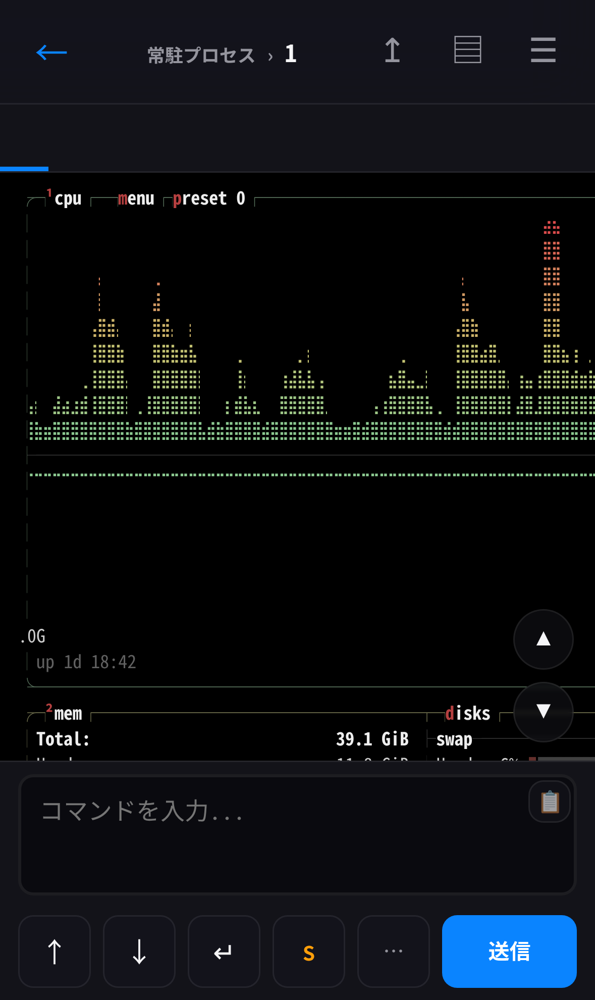
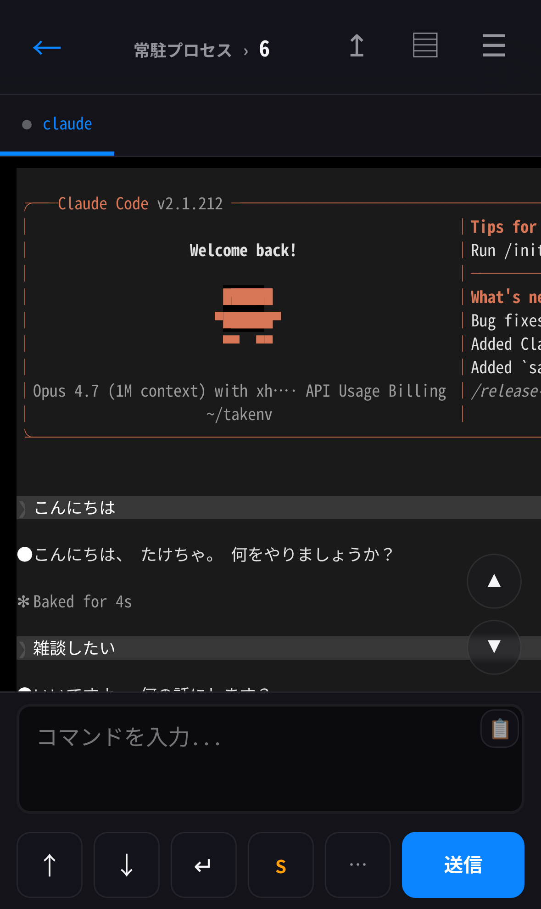
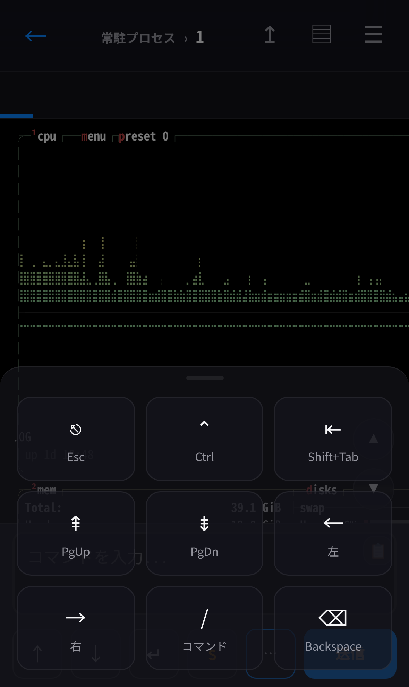
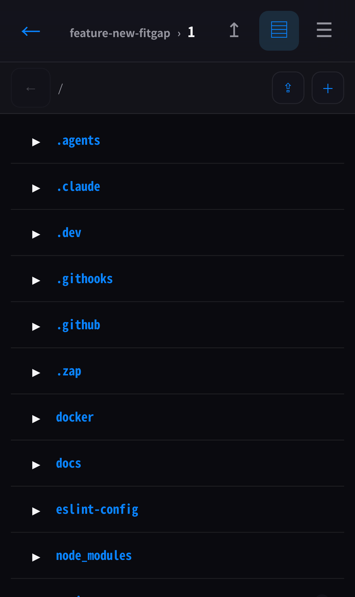

# tmuxui

[](https://github.com/BambooTuna/tmuxui/releases)
[](https://opensource.org/licenses/MIT)

English | [日本語](README.md)

A mobile web UI for monitoring and controlling **tmux / [herdr](https://github.com/BambooTuna/herdr)** sessions. Check on long-running Claude Code (or other CLI agent) tasks, catch permission prompts, send follow-up instructions, and upload files while away from your computer.

|  |  |
|:--:|:--:|
| **Session list** (herdr / tmux tabs, agent state dot) | **Settings** (auto-update, version switch) |
|  |  |
| **Pane detail: system monitor** (btop rendered as-is via xterm.js) | **Pane detail: agent chat** (talk to Claude Code from the road) |
|  |  |
| **Extended key sheet** (Ctrl / PgUp/Dn / arrows / Backspace, one-handed) | **Filer** (browse, upload, HTML preview) |
|  |  |

## Why

Agentic coding changed where the bottleneck is. Once you hand a task to Claude Code, or a herdr team, you often wait minutes for it to come back — and there's less and less reason to be glued to the laptop while that happens. But the moment you step away, the agent hits a permission prompt, asks a clarifying question, or finishes and sits idle waiting for the next instruction.

tmuxui is a phone-side remote for that gap. Open it on the train or from a café, glance at what each agent is doing across your projects, approve the permission prompt it's blocked on, paste a snippet of extra guidance, or drop a file into the working directory — one-handed, without unlocking the laptop.

It works against plain tmux sessions and against [herdr](https://github.com/BambooTuna/herdr) (a tmux-shaped multiplexer built for coding agents); the top tabs switch between them.

## Install

### Binary download (recommended)

```bash
curl -sL https://api.github.com/repos/BambooTuna/tmuxui/releases/latest \
  | grep "browser_download_url.*$(uname -s | tr A-Z a-z)_$(uname -m | sed 's/x86_64/amd64/;s/aarch64/arm64/')\.tar\.gz" \
  | cut -d '"' -f 4 \
  | xargs curl -sL | tar xz -C /usr/local/bin tmuxui
```

(`/usr/local/bin` usually needs `sudo`; use a user-writable directory otherwise.)

### go install

```bash
go install github.com/BambooTuna/tmuxui@latest
```

### Sanity check

```bash
tmuxui --help
```

### Docker (for daemonising / auto-start)

Mount the host's tmux / herdr sockets into the container. The tmux (or herdr) server keeps running on the host; the container only runs tmuxui as a client on top of those sockets. Useful when you'd rather have `restart: unless-stopped` bring it back after a reboot than wire up systemd yourself.

Requirements:

- Linux host. `network_mode: host` and the socket mounts don't work on Docker Desktop for macOS — run tmuxui natively there.
- tmux or herdr is already running on the host (server on the host, tmuxui in the container: strictly one-way).

`.env` (next to `docker-compose.example.yml`):

```bash
UID=1000
GID=1000
TMUXUI_TOKEN=your-secret-token
```

Copy `docker-compose.example.yml` to `docker-compose.yml` and start:

```bash
cp docker-compose.example.yml docker-compose.yml
docker compose up -d
# http://127.0.0.1:6062?token=your-secret-token
```

The image is `ghcr.io/bambootuna/tmuxui:latest` (multi-arch amd64/arm64, pushed by the release workflow).

Notes:

- Auto-update is on by default and can be triggered from the settings screen, but inside a container it just rewrites the container filesystem — the next `docker compose up -d` restores the image version. For a durable upgrade run `docker compose pull && docker compose up -d`. To turn auto-update off entirely, set `TMUXUI_AUTOUPDATE=0` in the container env.
- The filer only sees host paths that are explicitly mounted in `docker-compose.yml`. Anything else is invisible from inside the container.

## Usage

### Local

```bash
tmuxui
# http://127.0.0.1:6062?token=xxx  (the exact URL is printed on startup)
```

### From your phone

#### Quick try: Cloudflare Quick Tunnel (free, no account)

Install [cloudflared](https://developers.cloudflare.com/cloudflare-one/connections/connect-networks/downloads/).

```bash
cloudflared tunnel --url http://localhost:6062 &
tmuxui --token mytoken  # Ctrl+C to stop
```

Open the printed `*.trycloudflare.com` URL on your phone. `--token` is mandatory because the URL is public. The URL changes on every run.

#### Everyday: Tailscale Serve (free, account required)

Install [Tailscale](https://tailscale.com/) on the PC and the phone and sign in with the same account (free tier covers 3 users / 100 devices). Only devices in your tailnet can reach it, the URL is stable, and HTTPS is handled for you.

```bash
tailscale serve --bg 6062
echo "https://$(tailscale status --json | jq -r '.Self.DNSName' | sed 's/\.$//')"
tmuxui  # Ctrl+C to stop
```

```bash
# Stop serving
tailscale serve --bg off
```

## Features

- **tmux and herdr, one UI** — auto-detected on startup; switch between them with the top tabs.
- **Live view** — sessions, windows and panes as a tree; herdr sessions also show an agent status dot (working / idle / blocked / done).
- **xterm.js rendering** — full ANSI colour and scrollback; the buffer is copyable as plain text.
- **Key input from the phone** — arrows / Enter / Ctrl+key / snippets, laid out for one-handed use.
- **Snippets** — drop text files in `~/.config/tmuxui/snippets/` (any extension) and send them to a pane with one tap. Filenames become labels.
- **Permission alerts** — detected Claude Code permission prompts pop up as notification banners; you respond in the pane itself. herdr panes use their structured blocked status instead.
- **Filer** — browse host directories, upload into `~/.tmuxui/uploads/YYYY-MM-DD/`, preview HTML files in the browser.
- **Session lifecycle** — create, rename, kill sessions from the phone.
- **Auto-update / version switch** — check for updates or switch to a listed release from the settings screen.
- **Mobile-first UI** — touch scrolling and a one-handed key sheet.

## CLI

| Flag | Default | Description |
|------|---------|-------------|
| `--port` | `6062` | Listen port |
| `--host` | `127.0.0.1` | Bind address |
| `--token` | *(auto-generated)* | Auth token (`TMUXUI_TOKEN` env var also works) |
| `--herdr` | `auto` | herdr backend: `off`, `auto` (probe the default socket), or an explicit socket path |
| `--dev` | `false` | Serve web assets from disk instead of the embedded FS |

Subcommands:

- `tmuxui version` — print the build version.
- `tmuxui update` — self-update to the latest release from the CLI.

Environment variables:

- `TMUXUI_TOKEN` — same as `--token`.
- `TMUXUI_AUTOUPDATE=0` — disable auto-update (kill switch, checked at runtime).

## License

MIT — see [LICENSE](./LICENSE).
